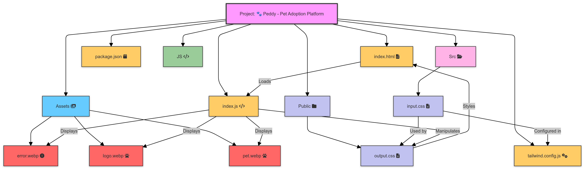

# 🐾 Peddy - Pet Adoption Platform

[](https://peddy-mybuddy.netlify.app/)
[](https://peddy-mybuddy.netlify.app/)
[](https://peddy-mybuddy.netlify.app/)

A modern pet adoption platform that connects furry friends with loving homes. Browse through various pets, like your favorites, and start your adoption journey with just a few clicks.

## Project Architecture

<figure>
 <p align="center">
     
     <p align="center">Project architecture diagram and workflow</p> 
 </p>
</figure>

## 🛠️ Technologies Used


## 🌟 Key Features

1. **Dynamic Category Filtering**

   - Instantly filter pets by categories (dogs, cats, birds, rabbits)
   - Smooth transitions between categories
   - Visual feedback for active category selection

2. **Smart Price Sorting**

   - Sort pets by price in ascending or descending order
   - Real-time price updates
   - Clear visual indication of sorting direction

3. **Interactive Like System**

   - Add pets to your favorites with one click
   - Persistent side panel showing liked pets
   - Quick remove functionality from liked pets panel

4. **Adoption Process**

   - Engaging countdown animation when adopting
   - Clear status indication for adopted pets
   - Detailed pet information in modal view

5. **Responsive Design**
   - Mobile-first approach
   - Seamless experience across all devices
   - Collapsible navigation for mobile users

## ⚡ ES6 Features Used

   - Arrow Functions
   - Template Literals
   - Destructuring Assignment
   - Async/Await
   - Array Methods (map, filter, find)
   - Set Data Structure

## 🎯 Learning Objectives

Through this project, I aimed to understand:

- Building responsive layouts with Tailwind CSS and it's DaisyUI framework
- Implementing modern JavaScript features (ES6+)
- Working with RESTful APIs
- Managing complex UI state
- Creating smooth animations and transitions

<details>
<summary>Further Learning (Click to Explore)</summary>

- Implement user authentication
- Add pet search functionality
- Create admin dashboard
- Integrate payment processing
- Add real-time chat feature
</details>

## 🔄 How I Use This Repository

To run this configuration:

1. Fork the repository
2. Enable GitHub Pages in repository settings
3. Configure custom domain (optional)
4. Deploy to Netlify or similar platform

<details>
<summary>View Installation Details</summary>

1. Clone the repository:
```bash
git clone https://github.com/TheToriqul/peddy-mybuddy.git
```

2. Navigate to the project directory:

```bash
cd peddy-mybuddy
```

3. Open `index.html` in your preferred browser or use a local server:

```bash
npm run build
```

</details>

<details>
<summary>View Usage Instructions</summary>

1. Browse pets by category using the category filters
2. Sort pets by price using the sort button
3. Like pets by clicking the heart icon
4. View detailed information by clicking the details button
5. Start adoption process by clicking the adopt button
</details>

<details>
<summary>View Configuration Details</summary>

The project uses the following APIs:

- `/api/peddy/pets` - Fetch all pets
- `/api/peddy/categories` - Fetch pet categories
- `/api/peddy/category/{category}` - Fetch pets by category
- `/api/peddy/pet/{id}` - Fetch specific pet details
</details>

## 📝 Notes

- The project uses modern JavaScript features and requires a recent browser
- All images are served from the project's asset directory
- API endpoints are configured for demonstration purposes

## 📚 Resources

- [Programming Hero's Complete Web Development Course](https://web.programming-hero.com/home)
- [Tailwind CSS Documentation](https://tailwindcss.com/docs)
- [JavaScript MDN Documentation](https://developer.mozilla.org/en-US/docs/Web/JavaScript)
- [Font Awesome Icons](https://fontawesome.com/icons)
- [REST API Best Practices](https://restfulapi.net/)

## 🤝 Contributing

1. Fork the repository
2. Create a new branch: `git checkout -b feature-name`
3. Make your changes and commit: `git commit -m 'Add feature'`
4. Push to the branch: `git push origin feature-name`
5. Submit a pull request

## 📞 Contact

For any questions or inquiries regarding the project, please feel free to contact me:

- 📧 Email: toriqul.int@gmail.com
- 📱 Phone: +65 8936 7705, +8801765 939006

## 🔗 Project Links

- [Live Demo](https://peddy-mybuddy.netlify.app/)
- [Developer Portfolio](https://thetoriqul.netlify.app/)

## 🙏 Acknowledgments

- Pet images provided by [Programming Hero](https://www.programming-hero.com/)
- Icons from Font Awesome
- UI inspiration from modern design trends

---

Feel free to explore, modify, and build upon this configuration as part of my learning journey. You're also welcome to learn from it, and I wish you the best of luck!
